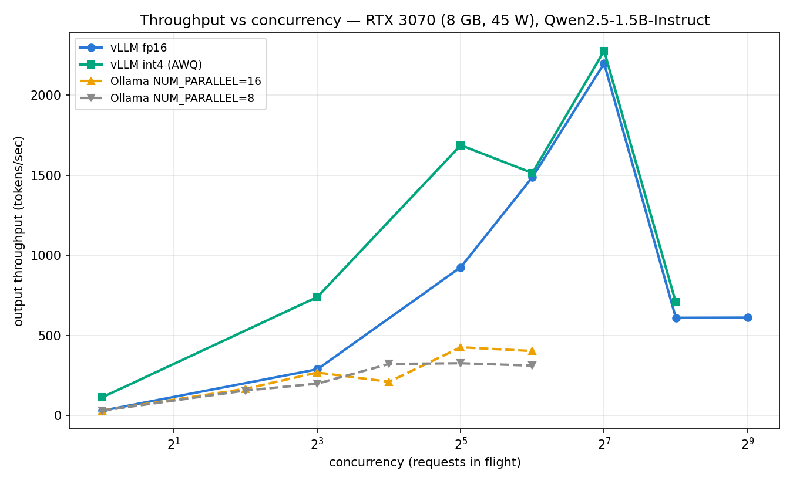
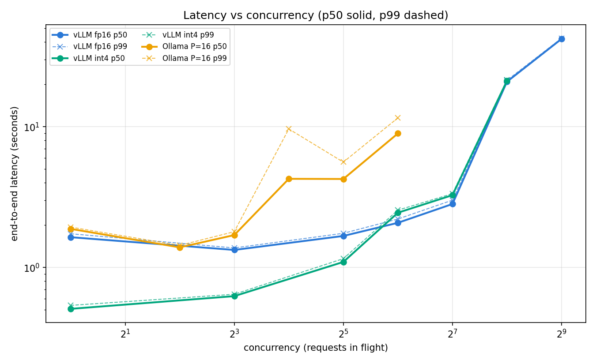
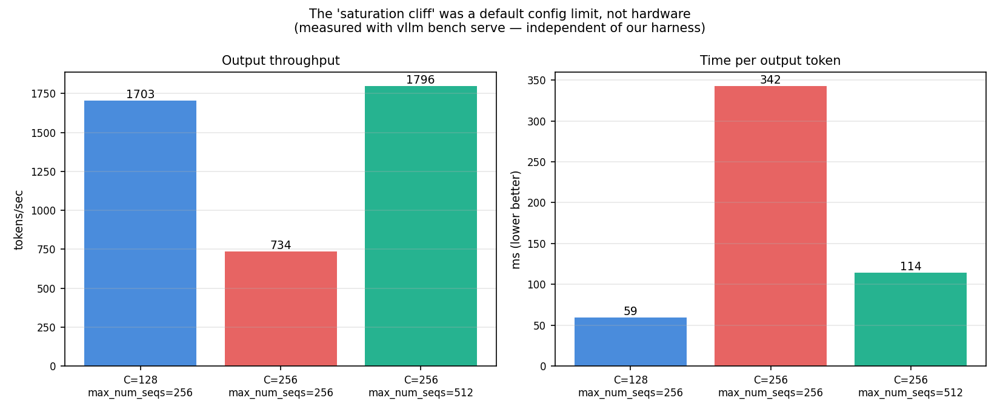
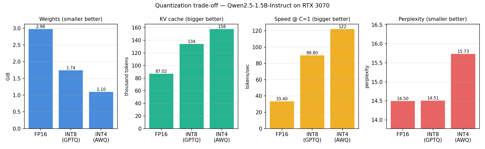
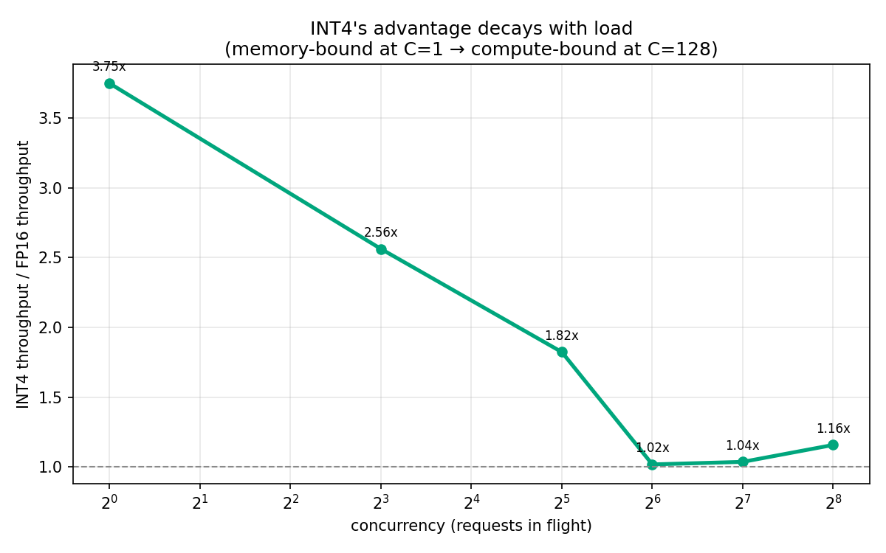

# LLM Inference Serving: An Honest Benchmark on Constrained Hardware

Benchmarking **vLLM**, **Ollama**, and **NVIDIA Triton** serving `Qwen2.5-1.5B-Instruct` on a
single 8 GB laptop GPU — measuring throughput, latency, memory, and **quality**, with a
methodology built to catch its own mistakes.

> **Headline finding: every performance ceiling I found in this study turned out to be a
> default configuration limit, not an architectural one.** Both engines' apparent
> "saturation points" moved when I changed a single setting. The engines were rarely the
> bottleneck — the defaults were.

A second theme runs alongside it: **four separate times, a measurement turned out not to be
measuring what it claimed.** Ollama's ceiling was a config flag. vLLM's cliff was a config
flag. My latency numbers were IPv6 resolution. Triton's "overhead" was three stack
differences wearing a trenchcoat. Each is documented below, including the two hypotheses I
proposed that the data refuted.

---

## Hardware & software

| | |
|---|---|
| GPU | NVIDIA RTX 3070 **Laptop** (8 GB VRAM, **45 W** power limit) |
| CPU / RAM | Intel i7 / 16 GB |
| OS | Windows 11 + WSL2 (Ubuntu) |
| Driver / CUDA | 581.95 / 13.0 |
| vLLM | 0.22.1 (running in WSL2) |
| Ollama | native Windows |
| Triton | 26.06 (`tritonserver:26.06-vllm-python-py3`, Server 2.70.0) |
| Model | `Qwen2.5-1.5B-Instruct` — fp16 / GPTQ-Int8 / AWQ-Int4 |
| **Measured** | **July 2026** |

Two details shape every number here. This is the **45 W laptop** 3070 — far less bandwidth
and compute than the 220 W desktop card of the same name, so absolute figures are not
comparable to desktop results. And the measurement date matters because the central finding
concerns **version-specific defaults** (`max_num_seqs=256` in vLLM 0.22.1), which will change.

Full versions and hand-recorded measurements: [`manifest.json`](manifest.json).

---

## 1. Throughput vs concurrency



| config | peak throughput | at concurrency |
|---|---|---|
| vLLM int4 (AWQ) | **2,276 tok/s** | 128 |
| vLLM fp16 | **2,197 tok/s** | 128 |
| vLLM int8 (GPTQ) | **2,061 tok/s** | 128 |
| Ollama `NUM_PARALLEL=16` | **426 tok/s** | 32 |
| Ollama `NUM_PARALLEL=8` | 326 tok/s | 32 |
| Ollama `NUM_PARALLEL=32` | 184 tok/s | 32 — *VRAM spill* |
| Ollama default | ~31 tok/s | flat at every level |

At **single-request** load the engines are **comparable** (vLLM 33 tok/s, Ollama 35 tok/s).
vLLM's advantage is entirely a concurrency story — continuous batching has nothing to batch
when there is one request.

### The number I almost published was wrong three times

Ollama's default configuration **serialises** requests: throughput pinned at ~31 tok/s across
every concurrency level while latency doubled with each doubling of load — the signature of
`OLLAMA_NUM_PARALLEL=1`. Taken at face value, that yields a **73×** advantage for vLLM.

Setting `OLLAMA_NUM_PARALLEL=8` closed the gap to **6.7×**. Sweeping further to `=16` closed
it to **~5.2×**. And `=32` *reduced* throughput to 184 tok/s, because the KV cache for 32
slots × 4096 context pushed the footprint to 7.7 GB and forced an **18% CPU offload** —
verified directly via `ollama ps` (`18%/82% CPU/GPU`).

**Ollama's ceiling on this hardware is VRAM-bound, not architectural.**

> **The ~5.2× figure is a ratio of two numbers that both benefit from prompt caching to an
> unquantified degree.** Both engines were driven with one identical repeated prompt; vLLM
> reported an **82% prefix-cache hit rate** under that workload, and Ollama's own prompt
> caching was never measured. The honest statement is *"~5.2× at the configurations and
> workload tested"* — not a clean architectural ratio. With random prompts,
> `vllm bench serve` returned 1,703 tok/s at C=128 against our 2,197; the equivalent
> correction for Ollama is unknown.

## 2. Latency — the other half of the story



Throughput without latency is a half-truth: a server can post excellent tokens/sec while
every user waits 40 seconds.

| p50 latency | C=1 | C=8 | C=32 | C=64 | C=128 | C=256 |
|---|---|---|---|---|---|---|
| vLLM fp16 | 1.64s | 1.33s | 1.67s | 2.08s | **2.82s** | 20.88s |
| vLLM int8 | 0.60s | 0.71s | 1.14s | 1.64s | **3.10s** | 13.56s |
| vLLM int4 | 0.51s | 0.63s | 1.09s | 2.45s | **3.26s** | 21.16s |
| Ollama `P=16` | 1.88s | 1.70s | **4.25s** | 8.95s | — | — |

**vLLM holds p50 under ~3 s while scaling throughput 72×** (30 → 2,197 tok/s from C=1 to
C=128). That is the continuous-batching win stated properly: for this workload, throughput
was nearly free in latency terms right up to the cliff. p99 tracks p50 closely throughout —
tight tails, predictable service.

**Ollama's latency begins climbing at C=16**, exactly where its throughput plateaus, then
grows linearly: 4.25s → 8.95s as concurrency doubles. Textbook post-saturation behaviour —
once throughput is pinned, Little's Law forces `latency = concurrency / throughput`, and
every additional request is pure queueing.

The vLLM explosion at C=256 is **not** saturation. See next section.

## 3. The "saturation cliff" was a default



Our sweeps showed a dramatic collapse at C=256: throughput 2,197 → 610 tok/s, p50 latency
2.8s → 20.9s. I proposed two explanations. **Both were wrong:**

| hypothesis | refuted by |
|---|---|
| *KV cache exhaustion* | vLLM's own logs reported `GPU KV cache usage: 3–8%` **during** the collapse. Doubling the cache via INT4 (87k → 158k tokens) did not move the cliff at all. |
| *Our load generator is the bottleneck* | `vllm bench serve` — an independent tool — reproduced it (12.65 req/s vs our 12.2 req/s). |

The actual cause: **vLLM's default `--max-num-seqs=256`.** Offering exactly 256 concurrent
requests to a scheduler capped at 256 sequences causes thrashing.

| C=256 (via `vllm bench serve`, random prompts) | `max_num_seqs=256` (default) | `max_num_seqs=512` |
|---|---|---|
| output throughput | 734 tok/s | **1,796 tok/s** (+145%) |
| time per output token | 342 ms | **114 ms** (−67%) |
| time to first token | 625 ms | 1,679 ms (**+169% — the cost**) |

This is a **trade, not a free win**: 2.4× throughput bought with 2.7× worse TTFT — more
sequences run concurrently, so each waits longer to start. **True saturation was never
located**; it lies above C=256.

## 4. Quantization: memory, speed, and quality



| precision | weights | KV cache | tok/s @ C=1 | perplexity | Δ vs fp16 |
|---|---|---|---|---|---|
| FP16 | 2.98 GiB | 87,024 tok | 33.4 | 14.498 | — |
| **INT8 (GPTQ)** | 1.74 GiB | 134,192 tok | 89.8 | 14.511 | **+0.09%** |
| INT4 (AWQ) | 1.10 GiB | 158,000 tok | 122.3 | 15.734 | **+8.52%** |

**INT8 is close to free — at single-request load.** 2.7× faster at C=1, 42% less VRAM, and
perplexity indistinguishable from FP16: **+0.09%**, within chunk-level noise — 3 of 10 text
chunks actually scored *better* than fp16. **The quality result holds unconditionally. The
speed result does not** (see §5).

**INT4 is not free.** +8.5% perplexity, and the degradation is **systematic, not noise**:
**10 of 10 chunks got worse**, ranging +3.7% to +13.4%. If quantization were harmless you
would expect roughly half the chunks to drift in each direction — as INT8 did. Ten out of ten
in one direction is not chance.

Perplexity was measured on a fixed **4,530-token WikiText-2 slice**, identical across all
three precisions, via vLLM's `prompt_logprobs`. It is deterministic — no sampling variance.
Perplexity was chosen over task accuracy because it is *sensitive*: every token contributes
signal, so a small degradation is detectable on thousands of tokens where a task eval would
need thousands of *questions* to clear the noise floor.

## 5. Quantization's speed advantage vanishes under load



Throughput relative to FP16, across the full sweep:

| concurrency | 1 | 8 | 32 | 64 | 128 |
|---|---|---|---|---|---|
| **INT8 (GPTQ)** | **2.74×** | 1.96× | 1.51× | 1.31× | **0.94×** |
| **INT4 (AWQ)** | **3.75×** | 2.56× | 1.82× | 1.02×* | **1.04×** |

Absolute throughput at C=128: FP16 **2,197**, INT8 **2,061**, INT4 **2,276** tok/s — a spread
of only **10.4%** across a **2.7× difference in weight size**.

At C=1, decoding is **memory-bandwidth-bound**: the GPU spends its time reading weights out of
VRAM, so fewer bytes means proportionally faster. At C=128 it is **compute-bound**: weight
reads amortise across the batch, dequantisation overhead applies, and the advantage
disappears.

**The convergence is the finding.** Three models with radically different memory footprints
landing within 10% of each other suggests a **shared hardware ceiling** — consistent with a
45 W power-limited GPU running out of compute rather than bandwidth.

> **Practical implication: on a busy server, quantization buys you memory, not speed.** That
> memory is still valuable — it is what lets a larger model fit, or a larger KV cache serve
> more concurrent contexts. But the tokens/sec headline quantization advertises is a
> **single-request phenomenon**. I predicted the opposite before measuring, and was wrong.

*\* INT4's C=64 point is unreliable: two identical runs gave 1.02× and 1.57× (throughput 1,514
vs 2,334 tok/s). The monotonic decay is robust across two independent precisions; the specific
multipliers rest on single runs with ~35% observed variance. See limitation #9.*

## 6. NVIDIA Triton Inference Server — deployed; comparison abandoned

**Triton 26.06 with the vLLM backend was successfully deployed and verified** serving
`Qwen2.5-1.5B-Instruct` on the RTX 3070 (`vllm_model | 1 | READY`), with the model repository
(`config.pbtxt` + `model.json`) configured to mirror the raw vLLM settings exactly
(`gpu_memory_utilization: 0.80`, `max_model_len: 4096`, `dtype: float16`).

The plan was to measure **what a production serving layer costs on top of the raw engine** —
same model, same engine, once bare and once wrapped in Triton. **That benchmark was abandoned
as unmeasurable on this setup.**

Three stack differences could not be eliminated:

- the container bundles vLLM `0.22.1+7b9cb5b7.dev` — the same version as the raw install, but
  a **dev build**, not the tagged release;
- it runs in **CUDA Minor Version Compatibility mode** (container built for CUDA 13.3, driver
  supports 13.0), while the raw install does not;
- vLLM logs **`pin_memory=False`** inside the container due to WSL detection, with an explicit
  warning that this may reduce performance.

**These are not theoretical.** At `temperature=0` — greedy decoding, no randomness — Triton
and raw vLLM produced **different completions for an identical prompt**. The same model with
the same input must produce identical tokens unless the stacks are not numerically equivalent.
They are not. Any measured latency delta would therefore conflate Triton's serving overhead
with these differences, with no way to attribute it — the same one-number-many-variables trap
that nearly ruined the engine comparison in §1.

A fourth difference was found and **solved**: Triton's `/v2/models/.../generate` endpoint takes
raw text and does **not** apply the model's chat template, while vLLM's `/v1/chat/completions`
does. Benchmarking without correcting for this would have compared *different prompts* and
called the difference "overhead." The Qwen2.5 template (`<|im_start|>` / `<|im_end|>`) was
applied manually and verified to produce correct, cleanly-terminated output.

**Conclusion:** Triton deployment on constrained hardware is demonstrated end-to-end. A
meaningful overhead measurement requires a container whose CUDA version matches the host
driver — the correct next step, not attempted here. Publishing a number that summed four
unattributable differences would have been worse than publishing none.

---

## Methodology

- **Warmup + repeated trials.** Single-request figures are 10 measured trials after 2
  discarded warmups, reported with spread (typical stdev < 2%).
- **Determinism.** `temperature=0` throughout, so every trial produces identical output and
  therefore performs identical work.
- **One ruler for every engine.** TTFT and latency are timed by *our* wall clock — not each
  engine's self-reported timings — so engines are measured identically. Token *counts* come
  from each engine's own reporting (`eval_count` / `usage.completion_tokens`), never from
  counting stream packets (an early version did, and was wrong by 20×).
- **Latency decomposition.** TTFT is broken into load / prefill / generate and reconciled
  against the engine's own reported total. **This is what caught the IPv6 bug** (#16).
- **Little's Law validation.** Every sweep row checks `concurrency ≈ throughput × latency` and
  reports achieved concurrency alongside requested. **This caught a silent bug:** with a fixed
  60 requests per level, levels above C=64 could never reach their target concurrency — five
  "different" levels were secretly the same experiment, and the resulting flat line looked
  exactly like a clean saturation plateau. Request counts now auto-scale to 10× concurrency.
- **Independent cross-validation.** Key results re-measured with `vllm bench serve`.
- **Sequential benchmarking.** Only one model fits in 8 GB, so engines are measured one at a
  time and compared from saved JSON.

---

## Limitations

Stated at length, because under-measured results are worse than no results.

1. **Single prompt.** Every sweep used one identical 22-token prompt. vLLM reported an **82%
   prefix-cache hit rate** as a direct result — throughput figures are inflated by caching a
   realistic workload would not receive. `vllm bench serve` with random prompts gave **1,703
   tok/s at C=128 against our 2,197**, implying **~30% inflation**. No prompt-length
   distribution was tested, so prefill behaviour is essentially uncharacterised.
2. **Closed-loop load generation.** N workers each fire the next request on completion. This
   couples offered load to server speed and suffers coordinated omission. Open-loop generation
   (Poisson arrivals at a fixed rate) is the rigorous approach and was not implemented.
3. **Engines benchmarked sequentially, not concurrently.** Two fp16 1.5B models exceed 8 GB, so
   both could never be resident. Runs are minutes apart, not simultaneous.
4. **Different environments.** vLLM ran in WSL2 (Linux); Ollama ran natively on Windows; Triton
   ran in Docker. Same physical GPU, different stacks.
5. **Bit-width and algorithm are conflated.** INT8 is GPTQ; INT4 is AWQ. "INT4 is 8.5% worse"
   partly measures *AWQ vs GPTQ*, not purely *8-bit vs 4-bit*. Isolating this requires
   `GPTQ-Int4`, which was not run.
6. **Quantization damage is likely size-specific.** +8.5% is higher than the 1–3% AWQ papers
   typically report — plausibly because a 1.5B model has less redundancy to absorb rounding
   error. **These results should not be extrapolated to 7B+.**
7. **Perplexity is a proxy.** +8.5% perplexity does **not** mean 8.5% worse answers. No
   downstream task accuracy (GSM8K, MMLU) was measured.
8. **Non-standard perplexity protocol.** A 20k-char WikiText-2 slice scored in independent
   chunks, not the full test set with sliding-window context. Absolute values are **not**
   comparable to published figures — only the deltas between precisions are meaningful.
   WikiText is also base-model text scored with an instruct model.
9. **Single-run sweeps.** Concurrency sweeps were run once, not repeated. Observed run-to-run
   variance at C=64 reached **~35%** (26.1 vs 40.3 req/s on identical INT4 configurations).
   **Sweep figures are far less reproducible than the single-request trials suggest.**
10. **True saturation never located.** With `max_num_seqs=512` the cliff disappeared; no higher
    concurrency was tested. The real ceiling is unknown.
11. **Ollama's parallelism not exhaustively swept.** Tested 1 / 8 / 16 / 32. `=16` was best;
    `=32` spilled to CPU. Intermediate and higher values untested.
12. **Unexplained: Ollama reports a fixed ~0.38 s `load_duration` per request** even with the
    model verified resident (`ollama ps` = 100% GPU), explicitly pinned (`keep_alive=30m`), and
    no other process on the GPU. Ruled out: model eviction (persists across rapid back-to-back
    requests) and GPU contention (persists with all other GPU apps closed). Cause unknown;
    bounded and separable, so tok/s figures are unaffected.
13. **Unexplained: Ollama's reported memory scales non-linearly** with `NUM_PARALLEL` — 3.3 GB
    at `=16` but 7.7 GB at `=32`, when 16 slots × 4096 context should already demand far more
    than 0.2 GB above the weights. Suggests lazy allocation or a silent cap on actual
    parallelism.
14. **Unexplained: bimodal latency in Ollama at C=16** (`NUM_PARALLEL=16`): p50 4.26s but p99
    9.59s — a >2× gap where every other measurement had p50 and p99 nearly touching. Some
    requests stalled while others proceeded. Not reproduced or diagnosed.
15. **No cost-per-million-tokens.** Not computed. It would be *modelled*, not measured, since
    this ran on owned hardware — presenting a notional figure as if incurred would be dishonest.
16. **A ~2 s measurement bug existed and was fixed mid-project.** On Windows, `localhost`
    resolved to IPv6 (`::1`) first and stalled ~2 s per request before falling back to IPv4.
    This **silently doubled every latency number** until it was caught by reconciling our wall
    clock against the engine's self-reported timings (`Overhead gap: 2.03s → 0.01s` after
    switching to `127.0.0.1`). The same bug reappeared later on the Windows→WSL2 bridge for
    vLLM (TTFT 2.10s → 0.07s once fixed). All published numbers use the fixed path. **Any
    result from before this fix would have been wrong and looked entirely reasonable.**
17. **Some inputs were hand-transcribed.** vLLM's weight/KV-cache figures and all
    `vllm bench serve` results were read off terminal output and typed into `manifest.json` by
    hand. They are not captured programmatically, and a transcription error would be
    undetectable. The concurrency, latency, and perplexity figures are unaffected — those come
    from harness-written JSON.
18. **Triton overhead unmeasured** — see §6. Deployment verified; the comparison was abandoned
    rather than report a figure conflating four unattributable stack differences.

---

## What I would do next

In priority order — the first three would strengthen **every existing result**, which is why
they outrank adding new chapters:

1. **Open-loop load generation** with Poisson arrivals — the single largest methodological gap
   (#2).
2. **Prompt-length distributions and random prompts** — kills the prefix-cache confound (#1)
   and characterises prefill, which is currently unmeasured. Best done together with (3).
3. **Repeat every sweep 3× and report spread** — 35% single-run variance is not publishable (#9).
4. **`GPTQ-Int4`** — separates bit-width from quantization algorithm (#5).
5. **Downstream task eval** (GSM8K subset) — translates perplexity into user-facing quality (#7).
6. **Sweep `max_num_seqs` properly** and map the throughput/TTFT Pareto frontier; locate true
   saturation (#10).
7. **A larger GPU** — test whether the quantization findings hold at 7B+ (#6).
8. **Triton overhead, properly** — requires a container whose CUDA version matches the host
   driver, so the stacks are numerically identical (#18, §6).
9. **TensorRT-LLM** — NVIDIA's own inference engine. Scoped as optional at the outset and not
   attempted: engine builds are heavy for 8 GB, and this GPU (Ampere) lacks the FP8 support
   that is TensorRT-LLM's main differentiator, so the likely finding is "comparable to vLLM"
   for substantial toolchain effort.

---

## Reproduce

```bash
git clone <repo> && cd llm-serving-optimization
python -m venv .venv && .venv\Scripts\Activate.ps1      # Windows
pip install -r requirements.txt

# Start ONE engine — 8 GB fits one model at a time.
# (in WSL2)
vllm serve Qwen/Qwen2.5-1.5B-Instruct --port 8000 --dtype float16 \
  --max-model-len 4096 --gpu-memory-utilization 0.80

python src/benchmark.py vllm        # single-request: TTFT, tok/s, spread
python src/concurrency.py vllm      # concurrency sweep + Little's Law validation
python src/quality.py vllm          # perplexity via prompt_logprobs
python src/plots.py                 # regenerate every figure
```

Swap `vllm` for `vllm-int8`, `vllm-int4`, or `ollama` (all defined in `config.yaml`).

For **Ollama**, set `OLLAMA_NUM_PARALLEL` **before** starting the server — it is read only at
startup, and the default serialises requests.

For **Triton** (in PowerShell, with the vLLM server stopped — both want port 8000 and the whole
GPU):

```powershell
docker run --rm --gpus all -p 8000:8000 -p 8002:8002 --shm-size=1G `
  --ulimit memlock=-1 --ulimit stack=67108864 `
  -v ${PWD}/model_repository:/models -v hf-cache:/root/.cache/huggingface `
  nvcr.io/nvidia/tritonserver:26.06-vllm-python-py3 tritonserver --model-repository=/models
```

Every figure is generated by `src/plots.py` from two sources: the raw JSON in `results/`
(written programmatically by the harness) and `manifest.json` (hand-recorded from server logs —
see #17).

## Repo layout

```
config.yaml            every knob; no hardcoded values
manifest.json          hardware, versions, hand-recorded log measurements
data/
  eval_text.txt        fixed perplexity text, committed for reproducibility
model_repository/      Triton model config (config.pbtxt + model.json)
src/
  client.py            engine adapters (Ollama + vLLM) behind one interface
  metrics.py           summary statistics + percentiles
  benchmark.py         single-request harness (warmup, trials, spread)
  concurrency.py       concurrency sweep + Little's Law validation
  quality.py           perplexity via prompt_logprobs
  prepare_eval_text.py one-off: builds data/eval_text.txt from WikiText-2
  plots.py             regenerates all figures from results/
results/               raw JSON, one file per run — immutable, never overwritten
plots/                 generated figures
```

Adding an engine means writing one adapter class and one config entry. Nothing else changes.
